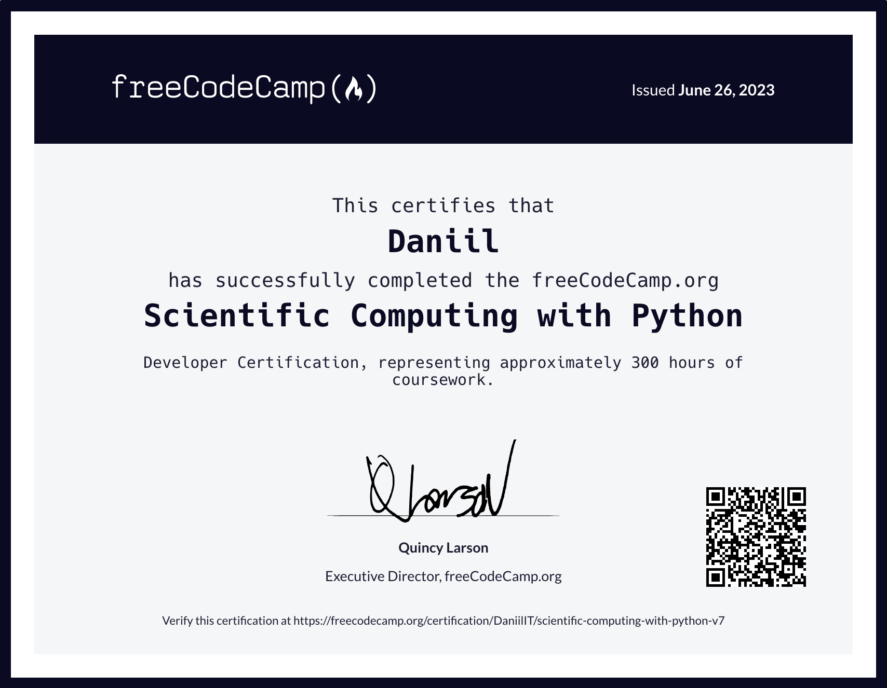

# Scientific Computing with Python

Здесь собраны выполненные задания из курса "Scientific Computing with
Python" [freeCodeCamp.org](https://www.freecodecamp.org/learn/scientific-computing-with-python/).

1. [Arithmetic Formatter](./arithmetic_arranger) \
   Функция, которая получает список строк, представляющих собой арифметические задачи, и возвращает задачи,
   расположенные вертикально и рядом. \
   Функция принимает второй аргумент. Когда для второго аргумента установлено значение True, отображаются ответы.

2. [Time Calculator](./time_calculator) \
   Функция добавляет время продолжительности к времени начала.

3. [Budget App](./budget) \
   Класс создаёт экземпляры объектов на основе различных категорий бюджета. \
   Функция возвращает диаграмму расходов в каждой категории.

4. [Polygon Area Calculator](./shape_calculator) \
   Класс Square, который является подклассом Rectangle.

5. [Probability Calculator](./prob_calculator) \
   Программа для выполнения большого количества экспериментов для оценки приблизительной вероятности случайного
   извлечения определенных шаров из шляпы.
